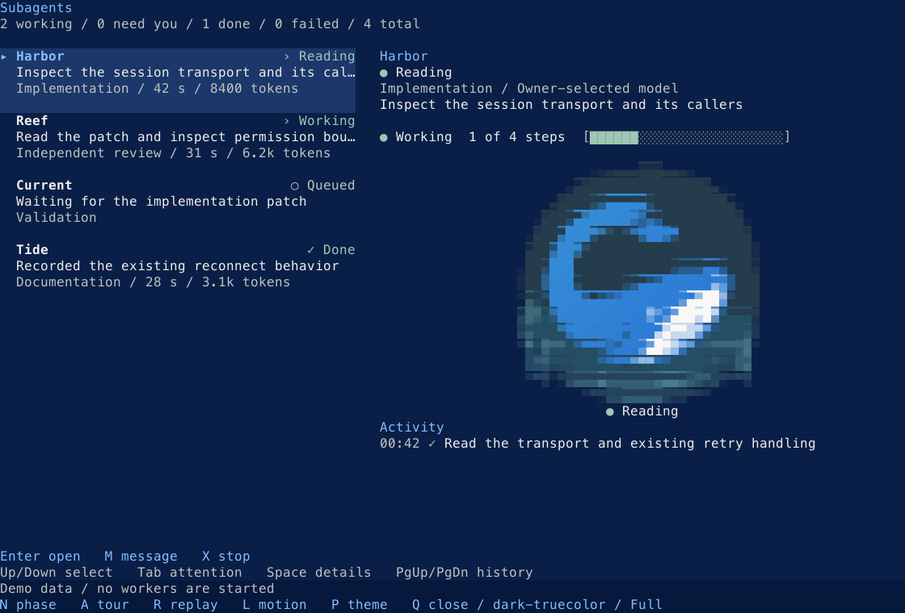

# Component source crosswalk

This library extracts the current Codewhale TUI into reusable Ratatui parts.
The native components preserve its layout and palettes. Optional compositions
retain useful desktop-inspired alternatives. See [VIEWS.md](VIEWS.md) for the
terminal view inventory and runnable recipes.

Source snapshots inspected for this crosswalk:

- **Engine:** `Hmbown/CodeWhale` at
  [`a79ce5c4d5ed1a5f7032185710c27343a900351c`](https://github.com/Hmbown/CodeWhale/tree/a79ce5c4d5ed1a5f7032185710c27343a900351c).
  Engine paths below start at `crates/tui/src/tui/`.
- **Native GPUI:** `Hmbown/codewhale-app` at
  [`ed626e636904ab5b5ae6df6306006d90497f10c6`](https://github.com/Hmbown/codewhale-app/tree/ed626e636904ab5b5ae6df6306006d90497f10c6).
  Native paths below start at `src/`. The shared character export separately
  pins `bc1044887b4ef973e444b6f8f83f9389daffee2a`; see
  [its provenance](assets/whale-motion/PROVENANCE.md).
- **Design authority:** `codewhale-design` at
  `642795c1f9ef465b8d4f4df8584d23be28af6e9f`, `DIRECTION.md` and
  `tokens.json` version **1.1.2**. This kit vendors its token release in
  [vendor/codewhale-design](vendor/codewhale-design).
- **Kit baseline:** `d02d14799b046fb6c9fdd3969c36ec9202251f34`, with the
  native component extraction represented below.

The current terminal source is the native baseline. Desktop references inform
optional cards and workspace compositions; the shared whale performance core
retains the native character. The library supplies reusable presentation and
input helpers, while each consuming app supplies its own data and actions.
The inspected terminal files are recorded in [assets/tui-source.json](assets/tui-source.json).

## From product source to kit parts

“Primitive” means a small visual or input building block. “Composite” means
a reusable arrangement of those parts over facts supplied by the host.
Gallery names are the exact names accepted by the gallery example; the
[gallery sources](src/gallery) contain the fixture calls and all variants.

| Native reference | Public kit family | Kind | Gallery entries |
|---|---|---|---|
| Engine `menu_style.rs::StatusMark`, `StatusKind`; GPUI `workspace/mod.rs::set_theme` and `workspace/render/conversation.rs` state readouts | `StatusMark`, `State`, `StateWords`, `Icon` | Primitive | `status-marks`, `icons` |
| Engine `views/mod.rs::ActionHint`, `widgets/key_hint.rs`; GPUI `chrome.rs::MenuRow`, `MenuSpec` | `KeyHint`, `KeyHints`, `Keymap`, `Binding`, `KeyChord` | Primitive | `key-hints`, `keymap-hints` |
| Engine `views/mod.rs::render_modal_surface`, `render_underwater_surface`; GPUI `workspace/dock/skin.rs::QuietDockSkin`, `TabStrip` | `Panel`, `Depth`, `Dialog`, `Sheet`, `HorizonRule`, `Heading`, `Tabs` | Primitive | `depth`, `dialog`, `sheet`, `horizon`, `heading`, `tabs` |
| Engine `views/mode_picker.rs::ModePickerView`, `views/status_picker.rs::StatusPickerView`, `views/mod.rs::EmptyState`; GPUI `workspace/palette.rs`, `modules/function_line.rs::FunctionLine` | `Picker`, `PickerQuery`, `PickerTabs`, `PickerMatches`, `List`, fuzzy matching helpers, `EmptyState` | Primitive/composite | `mode-picker`, `status-picker`, `picker-query`, `picker-tabs-preview`, `picker-no-match`, `list`, `list-scrolling`, `list-tall-rows`, `list-empty`, `empty-state` |
| Engine `app/composer.rs`, `views/automations/editor.rs`; GPUI `workspace/render/composer.rs`, `workspace/settings/mod.rs::Field`, `Control` | `LineBuffer`, `TextInputState`, `TextInput`, `Form`, `Toggle`, `Segmented` | Primitive/composite | `text-input-empty`, `text-input-typed`, `text-input-secret`, `text-input-invalid`, `text-input-disabled`, `text-input-wide-text`, `form`, `toggle`, `segmented` |
| Engine `history/message.rs::render_message`, `composer_chrome.rs::ComposerChrome`, `widgets/tool_card.rs::ToolFamily`, `CardRail`; GPUI `workspace/render/conversation.rs::render_prepared_row`, `workspace/render/composer.rs` | `Message::native`, optional `Composer`, `ToolCard` | Native inline message / optional composites | `message`, `composer`, `tool-card` |
| Engine `widgets/agent_card.rs::DelegateCard`, `FanoutCard`, `AgentLifecycle`, `views/fleet_roster.rs::FleetRosterView`; GPUI `workspace/dock/agents.rs::AgentsModule` | `AgentCard`, `Fleet` | Composite | `agent-card`, `fleet`, `fleet-scene` |
| Engine `phase_strip.rs::TidelineFooter`, `workspace_context.rs`; GPUI `workspace/dock/skin.rs::QuietDockSkin`, `workspace/render/composer.rs` context controls | `WorkspaceFrame`, `WorkspaceAreas`, `PaneHeader`, `ContextRibbon`, `ContextItem` | Composite | `workbench-frame`, `pane-header`, `context-ribbon`, `context-ribbon-narrow`, `workspace-scene`, `workspace-scene-narrow` |
| Engine `work_surface/{model,input,views}.rs`, `work_surface/render/{mod,layout,rows}.rs` | `Workbar`, `WorkbarRow`, `WorkbarPanel`, `WorkbarState`, `WorkbarLayout`, `WorkbarScrollbar`, `DockTabRow`, `DockTabPlan`, `DockTabEntry`, `DockTabStyles`, `DockTabTarget` | Native extraction | `workbar-tasks`, `workbar-fleet`, `workbar-jobs`, `workbar-files`, `workbar-notes`, `workbar-context`, `workbar-git`, `workbar-cost`, placement and narrow variants |
| Engine `widgets/workbar.rs` | `WorkflowProgress`, `WorkflowRun` | Native extraction | `workflow-*` |
| Engine `widgets/mod.rs`, `composer_chrome.rs`, `composer_ui.rs`, `mouse_ui.rs` | `NativeComposer`, `NativeComposerFrame`, `NativeComposerPlan`, `NativeComposerSourcePlan` | Native extraction | `native-composer-*` |
| Engine `phase_strip.rs`, `infoline.rs`, `ui/frame.rs` | `PostureBar`, `MetricsLine`, `TerminalShell` | Native extraction | `posture-*`, `metrics-*`, `showcase-work`, `showcase-narrow` |
| Engine `views/mod.rs::render_underwater_surface`, `session_picker.rs::SessionPickerView` | `InstrumentSurface`, `SessionList`, `SessionRow` | Native extraction and view recipes | `native-*` |
| Engine `crates/palette/src/{rgb,tokens,themes}.rs` | `TuiPalette`, `TuiInk` | Generated source palette | all 16 `tui-theme-*` previews |
| Engine `widgets/pending_input_preview.rs::PendingInputPreview`, `ContextPreviewItem`; GPUI `workspace/queue.rs::QueuedMessage`, `RowAction`, `Workspace::render_queue`, `workspace/render/composer.rs` attachments | `PendingInputPreview`, `PendingInputItem`, `PendingInputStatus`, `PendingInputAction`, `ContextPreviewItem`, `ContextPreviewState`, `PendingCard`, `PendingCardWords`, `PendingCardContext`, `PendingCardStyles` | Composite | `pending-queued`, `pending-steering`, `pending-paused`, `pending-context`, `pending-native-mixed`, `pending-native-queued` |
| Engine `markdown_render.rs::Block`, `RenderedMarkdownLine`, `history/message.rs::render_message_with_copy_metadata`; GPUI `workspace/markdown.rs::MessageText`, `text`, `sanitize` | `Transcript`, `TranscriptBlock`, `TranscriptSpan`, `TranscriptSpanRole`, `CodeBlock`, `TranscriptLink`, `TranscriptAction` | Primitive/composite | `transcript-prose`, `transcript-list-table`, `transcript-code`, `transcript-links` |
| Engine `widgets/mod.rs::ChatWidget`, `agent_focus.rs::render_focus`, `live_transcript.rs::LiveTranscriptOverlay` | `TranscriptViewport`, `TranscriptViewportPlan`, `TranscriptViewportStyles`, `TranscriptScrollFacts` | Native extraction | `transcript-mounted`, `transcript-mounted-focus` |
| Engine `agent_roster.rs::render_agent_roster`, `widgets/workflow_panel.rs::row_receipt_text`, `gate_receipts.rs`; GPUI `usage.rs::TurnRow`, `workbar.rs::Readout`, `working_context.rs::ExecutionReceipt` | `Receipt`, `ReceiptTable`, `ReceiptValue`, `Cost`, formatting helpers | Primitive/composite | `receipt-row`, `receipt-table`, `receipt-table-compact`, `receipt-table-minimal`, `receipt-table-clipped` |
| Engine `diff_render.rs::BoundedDiffRender`, `render_diff_bounded`, `history/file_mutation.rs`; GPUI `review.rs::DiffRowKind`, `workspace/render/review.rs::ReviewRows` | `Diff`, `DiffLine`, `DiffKind`, `DiffGutter`, `DiffHighlight`, `parse_unified` | Primitive | `diff`, `diff-wrapped`, `diff-no-numbers`, `diff-highlighted`, `review-scene` |
| Engine `widgets/workflow_panel.rs::WorkflowPanel`, `WorkflowPanelRow`, `history/checklist.rs`; GPUI `plans.rs`, `workspace/render/workers.rs` | `WorkflowTree`, `TreeNode`, `TreeState`, `CountBar` | Primitive/composite | `workflow-tree`, `workflow-tree-selected`, `workflow-tree-clipped`, `workflow-tree-long`, `count-bars` |
| Engine `approval/view.rs::ApprovalView`, `approval/elevation.rs::ElevationView`, `auto_review.rs`; GPUI `workspace/render/conversation.rs::Workspace::render_attention`, `workspace/render/review.rs::Workspace::render_restore_confirmation` | `ApprovalCard`, `ApprovalSubject`, `ApprovalState`, `ApprovalChoice`, `ApprovalPaint`, `DecisionBand`, `DecisionBandPlan`, `DecisionBandAction`, `DecisionBandSave`, `ReviewVerdict`, `ReviewAggregate` | Composite | `approval-command`, `approval-outside`, `approval-patch`, `approval-elevation`, `approval-clipped`, `approval-spoofed`, `approval-native-band`, `approval-native-band-collapsed`, `review-verdicts`, `review-aggregate` |
| GPUI `workspace/render/conversation.rs::Workspace::render_attention`, `workspace/render/files.rs::Workspace::render_artifact_column` | `AttentionQueue`, `AttentionItem`, `ArtifactShelf`, `Artifact` | Composite | `attention-queue`, `attention-focused`, `attention-narrow`, `attention-empty`, `artifact`, `artifact-shelf`, `artifact-narrow`, `artifact-unknown`, `artifact-empty` |
| Engine `views/mod.rs::ConfigView`, `ConfigRow`, `ConfigView::render_setting_detail`; GPUI `settings.rs::Spec`, `Applies`, `workspace/settings/mod.rs::Settings` | `SettingRow`, `SettingDetail`, `SettingWords` | Composite | `setting-row`, `setting-detail` |
| Engine `app/status.rs::StatusToast`, `StatusToastLevel`, `spinner.rs`, `spinner.rs::verification_tick_frame`; GPUI `workspace/notify.rs::ThreadNotice`, `workspace/motion.rs` | `Toast`, `Toasts`, `Ttl`, `Spinner`, `VerificationSpinner`, `MotionMode`, `MotionStep`, `MotionSet`, `FrameBudget` | Primitive/composite | `toasts`, `toasts-stacked`, `toasts-fading`, `spinner`, `verification-pending`, `verification-earned`, `verification-modes`, `motion-modes`, `motion-working`, `motion-started`, `motion-mid-flight`, `motion-settled`, `motion-reduced` |
| Engine `ambient_life.rs`; GPUI `whale/habitat.rs`, `whale/stage.rs::CoveScene` | `Habitat`, `FishSchool`, `Jellyfish`, `BubbleField`, `HabitatDensity` | Primitive/composite | `fish-school`, `jellyfish`, `bubble-field`, `habitat-scene`, `habitat-ascii`, `habitat-reduced` |
| GPUI `whale/acting.rs::Director`, `whale/rig.rs`, `whale/scene.rs`, `whale/stage.rs::Stage`, canonical `vendor/whale-character-v2` authoring data; Engine `ambient_life/pet_widget.rs::render_grid`, `pet_watch/mod.rs` | `BrailleFrame`, `Whale`, `WhaleState`, `Whale::paint_frame`, `whale_motion::{Director, Stage, Inputs}`, colored Braille frame helpers | Character renderer/shared performance core | `whale-rest`, `whale-busy`, `whale-needs`, `whale-done`, `whale-pod-1`, `whale-pod-3`, `whale-actions`, `whale-compact`, `whale-words-only`, `showcase-life` |
| Engine `ocean.rs::OceanRamp`, `OceanColumn`, `underwater.rs::ShellPhase`; canonical logo and semantic tokens | `OceanRamp`, `OceanColumn`, `OceanPhase`, `OceanPaintFacts`, `OceanCausticFacts`, `OceanContrastInks`, `ocean_semantic_surfaces`; optional `Ombre`, `OmbreDirection`, `WaterPalette` | Background finishing passes | `ocean-column`, `ocean-phases`, `ocean-context`, `ocean-reduced`, `ocean-native-guarded`; `atmosphere-ocean`, `atmosphere-lagoon`, `atmosphere-dusk`, `atmosphere-coral`, `atmosphere-graphite`, `showcase-color` |
| Shared native whale performance and cove | `WhalePet`, `PetStyle`, `Stage` | Composite | `pet-cove`, `pet-reading`, `pet-needs-you`, `pet-pod` |
| Shared pet work surface | `PetMode`, `PetModeState` | Composite | `pet-mode` |

The integrated `showcase-work`, `showcase-decision`, `showcase-color`,
`showcase-life` and `showcase-narrow` scenes arrange existing components with
illustrative facts. They are examples of composition, not additional
production session models.

## Pending input and authored transcript

These additive APIs close two concrete visual gaps found in the source
comparison. They represent the implementation slice's public contracts;
they do not claim the Engine or GPUI queue/parser has been migrated.

`PendingInputPreview::new(items, context)` accepts stable caller IDs,
reported pending states, attached context and optional selected ID. Its
`actions()`/`actions_for()` are metadata: the host sends, edits or drops an
item and reports the resulting state. An empty preview takes zero rows.
`Unconfirmed` context must not become an assertion that a file was included
or sent. Approval policy and attention prioritization remain with the host;
compose this preview beside `AttentionQueue` and `Composer` as appropriate.

`PendingCard` accepts the native composer's sending, editing and queued input,
independent context inclusion/removability/selection facts, priority notices,
localized `PendingCardWords` and optional five-slot `PendingCardStyles`. It
shares one measured row plan with `PendingInputPreview`, including clipping
and the one-row controls fallback. The host still owns every queue mutation,
child request and keyboard action.

`Transcript::new(blocks)` accepts already-authored blocks and semantic
spans. Headings, prose, quotes, lists, tables and `CodeBlock` do not require
another Markdown parser. `CodeBlock::copy_text()` supplies the original
source; the host decides whether to put it on the clipboard. `links()`
returns targets out of band; the host validates and dispatches them.
The text displayed on the terminal is sanitized independently of the source
bytes used for copy or link actions.

## Host responsibilities

- **Engine and store:** the host owns sessions, turns, provider routing,
  tools, permissions, queue mutation, persistence and event ordering. A
  painted state or receipt is exactly what the caller supplied.
- **Input and actions:** kit state helpers report outcomes. They never
  launch tools, submit prompts, allow commands or discard files. Approval
  hosts retain the arm-after-paint guard and handle incomplete subjects.
- **Parser and highlighter:** the host owns Markdown parsing and syntax
  highlighting. The kit paints structured transcript blocks and supplied
  diff lines. `parse_unified` is a display convenience, not a diff engine.
- **Clipboard and links:** copy text and link targets are metadata. The host
  owns clipboard access, URL validation and opening the destination; no
  terminal escape sequence or inline media loader is introduced.
- **Clock and redraws:** elapsed `Duration` and sampled `Instant` come from
  the host. The host owns one event loop and redraw schedule. Spinners,
  transitions, habitat and Ocean do not acquire their own clocks.
- **Character performance:** keep one host-owned `whale_motion::Stage` or
  `Director` per identity. Feed authoritative observed inputs into that core,
  then paint its frame; widgets do not infer agent activity or instantiate
  independent Directors.
- **Colors:** `Theme` and the vendored roles remain the authority for state
  ink, actions and semantic surfaces. Native Ocean's exact dark stops apply
  to ordinary grounds under known dark truecolor Underwater; other native
  presets, lower depths and terminal-owned shells retain their own grounds. `Ombre` offers opt-in spatial washes, not new state
  hues. Character and syntax colors are content.

## Live GPUI whale pet

The `pet-cove`, `pet-reading`, `pet-needs-you` and `pet-pod` gallery entries
show this widget in every terminal profile. `pet-mode` shows the full idle
work surface. The catalogue uses explicit sample activity and fixed times.

`WhalePet` is a stateful Ratatui widget over the same `whale_motion::Stage`
as GPUI. It paints the full-color contour whale in its animated cove, including
eyes, fins, spring transitions, authored props, particles and delegated calves.
Its state is the host's existing Stage; rendering never advances time.


[Light appearance preview](assets/readme/pet-light.gif).

```rust,no_run
use codewhale_ratatui::{Theme, WhalePet, whale_motion::{Stage, Tier}};

fn draw(frame: &mut ratatui::Frame<'_>, stage: &mut Stage, theme: &Theme) {
    stage.advance(std::time::Instant::now());
    frame.render_stateful_widget(WhalePet::new(theme), frame.area(), stage);
    // The event loop schedules the next redraw with stage.cadence(Tier::Hero).
}
```

Call `Stage::observe` with the foreground identity and authoritative owner
inputs when they change. Use `.words(...)` for localized status text,
`.cove(false)` for the standalone companion, `.direction(...)` for the rig's
mark/cruise/open views, and `.style(PetStyle::Braille)` for the compact dot
renderer. Hero color motion uses the existing 30/8 Hz action/rest ceilings;
Braille uses `Tier::Terminal` at 6/2 Hz. Reduced motion schedules no animation.
Monochrome and unknown grounds fall back to Braille; ASCII and tiny areas
retain status words. Colors and state marks never replace those words.

`WhalePet::point(area, column, row)` maps a terminal mouse cell to cove design
coordinates. The host forwards a valid point to `Stage::cove_observe` or
`Stage::cove_tap`, and calls `Stage::cove_leave` outside the art. These gestures
are decorative and never change agent activity.

Run `cargo run --locked --example pet` for a live tour of all 17 actions,
with arrows for manual preview, pointer attention, water ripples, color/Braille,
three views, terminal profiles and reduced motion. `--frames DIR` exports
reproducible actual-buffer animation frames; `--profile light-truecolor` selects
the light preview. These are explicit demonstration inputs, not live Engine
or shared-owner acceptance.

## Subagent roster and full output

`SubagentView` adds stable selection, a focused pane and scrollable full results
to the existing `AgentCard` presentation. The host supplies every status,
activity, timestamp and result. `SubagentUsage` keeps exact input/output token
receipts and microdollar costs separate: missing is `—` (`-` in ASCII), zero is
zero, and a subcent cost stays visible. Legacy token text is still supported.
Reported step counts have no invented denominator or completion percentage.



[Light sample preview](assets/readme/subagents-light.gif).

```rust,no_run
use codewhale_ratatui::{
    AgentCard, MotionMode, State, Subagent, SubagentView, SubagentViewState, Theme,
};

// Populate these facts from your runtime's worker record.
let agents = vec![Subagent::new(
    "review",
    AgentCard::new("Review", State::Working).task("Review the patch"),
)];
let mut view_state = SubagentViewState::default();
let theme = Theme::detect();
view_state.update(&agents, std::time::Instant::now(), MotionMode::Full);
// frame.render_stateful_widget(
//     SubagentView::new(&agents, &theme), frame.area(), &mut view_state,
// );
// After painting, wait for view_state.next_frame_in(&agents, &theme) or input.
```

Use unique, nonempty IDs and keep one `SubagentViewState` per surface. Selection
follows identity through reordering. The canonical Stage has one clock and is
not Clone. Up/Down or J/K, Home/End and click select; Tab/Shift-Tab reaches
NeedsYou/Failed workers. The mouse uses recorded painted IDs, checked against
the current roster. Space or Left/Right switches compact roster/details.
O switches output/activity when an outcome exists. PageUp/PageDown and the
mouse wheel scroll the pane. Results open at the beginning; activity follows
the newest receipt until scrolled back. Appended receipts preserve that older
viewport. Full results use usize row indices, including beyond 65,535 lines.

Wide terminals show both panes. Compact details wrap reported usage and remove
pet scenery before content. The native `WhalePet` is a smaller companion and
receives explicit canonical `Inputs`; this component never classifies task
text. Working/checking marks earn the native delay independently. Only visible
work or a brief observed Working → Done flourish requests frames. Reduced,
Still, hidden, empty and settled surfaces request no animation redraws. The
host retains completed workers and calls `set_visible(false)` when hidden.
`SubagentViewWords` owns labels and summary; `AgentCard` owns each status word.

Enable only currently authorized `SubagentControls`. Enter/M/X return
`SubagentIntent::Open`, `Message` or `Stop` with the worker ID. The host performs
current ownership and permission checks, including stop confirmation. Empty or
duplicate IDs cannot receive intents, and held action keys do not repeat them.
The component never changes a worker's reported state or executes an action.

The example starts **empty**, with no scripted work:

```sh
cargo run --locked --example subagents
cargo run --locked --example subagents -- --roster /path/to/roster.json --watch
```

`--roster` reads the existing Engine `AgentRosterRow` array, an `AgentList`
object with `roster`, or its protocol `EventEnvelope`. R reloads; `--watch`
checks the file twice a second without repainting unchanged data. Invalid or
partially written files keep the last good snapshot visible with an error.
A changed owner/session ID resets selection and presentation history. Array
inputs should contain a single owner's roster; they carry no session identity.
Waiting, parked, cancelled and unknown states retain distinct labels. The
adapter uses typed lifecycle state for the pet's presence; it invents no
classified activity, event history, permissions, model route or usage. Snapshot
viewing defaults to reduced motion. L changes motion, P changes profile.
Worker controls stay disabled because a roster receipt grants no authority.

This is a read-only **file viewer**, not a connection to a running Engine.
The reusable component has not been adopted into the Engine subagent manager.

`--demo` opts into explicitly labelled sample states with no fictional task
outcomes or usage. N advances the sample state and R replays. Generate the
sample GIF sources with `--demo --frames DIR`; `--profile light-truecolor`
selects Paper and `--size 48x26` captures compact roster/details. These previews
establish rendering and interaction only, not real worker execution.

## Shared native Dock tabs and packed character raster

`Workbar` uses `DockTabRow` for its fitted tab paint and hitboxes. The Engine
adapter supplies available panels, counts, active/pressed/hovered targets, live
styles and the actual close label. `DockTabPlan` sheds counts before inactive
right-hand tabs and exposes only painted action boxes. Engine continues to own
keyboard focus, detail precedence, Esc meaning and every action. This shares the
tab row; it does not claim that Engine's full Dock body uses `Workbar`.

`BrailleFrame` paints the existing host's row-major packed cells and raw caption
with the supplied ink and modifiers, including the Engine's 18×5 cameo raster
and embedded world's current raster through their shared `render_grid` facade.
Zero cells remain transparent; a tiny viewport retains the wrapped caption.
`Whale::paint_frame` uses the same packed-cell painter while retaining its
semantic state words, whole-frame admission and theme gradient. Neither path
adds a clock, simulation, color classification or a new character authority.

The existing `ocean-native-guarded` gallery directly uses `OceanPaintFacts`,
`OceanCausticFacts` and `ocean_semantic_surfaces`. `OceanContrastInks` supplies
the host role mapping for guarded native finishing. These are
presentation facts and protection helpers; they do not grant terminal capability
or weaken motion, selection, REVERSED or contrast guards.

`WorkbarLayout::for_body` shares header folding, overflow reservation, content
geometry and offset fitting with Engine's body viewport. `WorkbarScrollbar`
shares its rail math and paint. Native row composition, detail/focus gutters
and caller action/tooltip projection remain Engine-owned; this does not yet
claim full row-composer replacement by `Workbar`.


## Full pet mode

`PetMode` composes the canonical GPUI whale and cove, the host's retained agent
roster, and its real response into one terminal work surface. `PetModeState`
owns only presentation: one parent `Stage`, focus, scroll, and recorded pointer
areas. The host supplies current session identity, typed `Inputs`, localized
status/labels, wrapped transcript lines, and every execution action.


[Light appearance](assets/readme/pet-mode-light.gif). Run
`cargo run --locked --example pet_mode` for this idle preview. It contains no
Engine connection, agents, responses, usage, or fabricated work.

`PetModeAreas::new` gives the host the exact response width for its existing
Markdown renderer. Wide terminals show the retained roster beside the pet and
response; narrower terminals switch to the roster when focused. Content takes
space before scenery. Response scrolling uses `usize`, including Home/End.
Streamed text follows the bottom until the reader scrolls back. End or scrolling
to the bottom resumes following; Home keeps the beginning in view. A new typed
turn identity resets following, and hosts can call `reset_output` at an explicit
turn-start event when an identity is not available yet.
The active pane has a visible heading marker in every color profile; clipped
responses show their visible row range. Clicking the response returns keyboard
focus to reading. Set `hints` for navigation and `pane_hints` for the focused
pane's controls to keep both visible on separate footer rows. Narrow headers
keep the activity label visible before the title, and clipped footer hints end
with an ellipsis.

Call `set_visible` and `update` before paint, and schedule only the deadline
returned by `next_frame_in`. Hidden/reduced views schedule no motion; a real
completion earns one short flourish and then settles. A new session clears
local focus and scroll. Roster clicks follow the painted worker ID; opening
returns an intent for the host's existing transcript/permission path. A tap
on the water affects only the canonical cove decoration.

The separate Engine adapter under review adopts this surface through `/pet on`, using its current-session
retained roster, active transcript, owner activity projection, modal stack and
existing agent transcript event. Escape returns to its preserved composer;
accepted turns return to the pet surface while the mode remains enabled.
