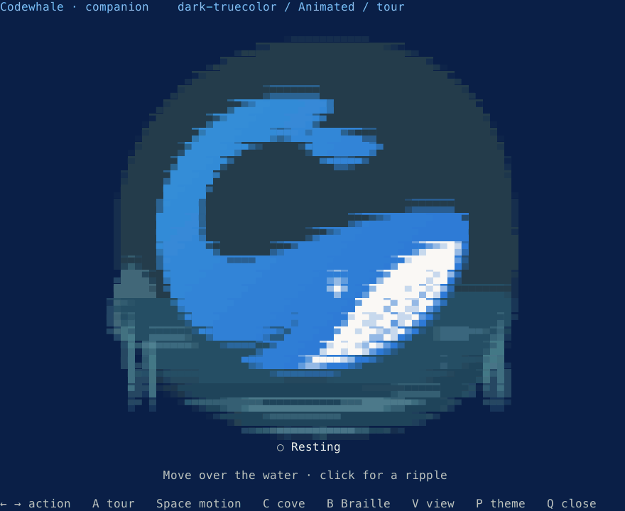
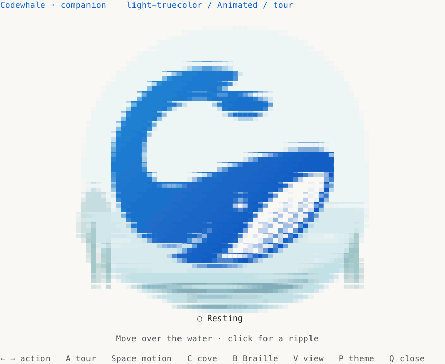
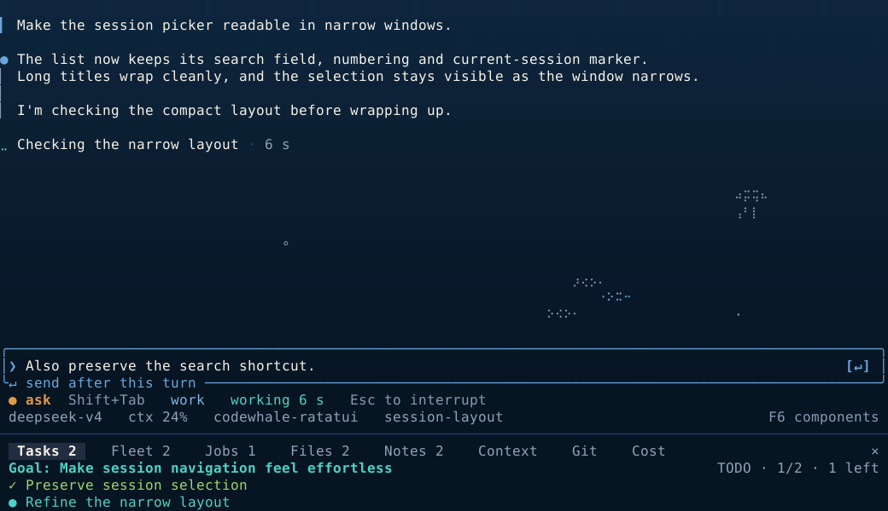
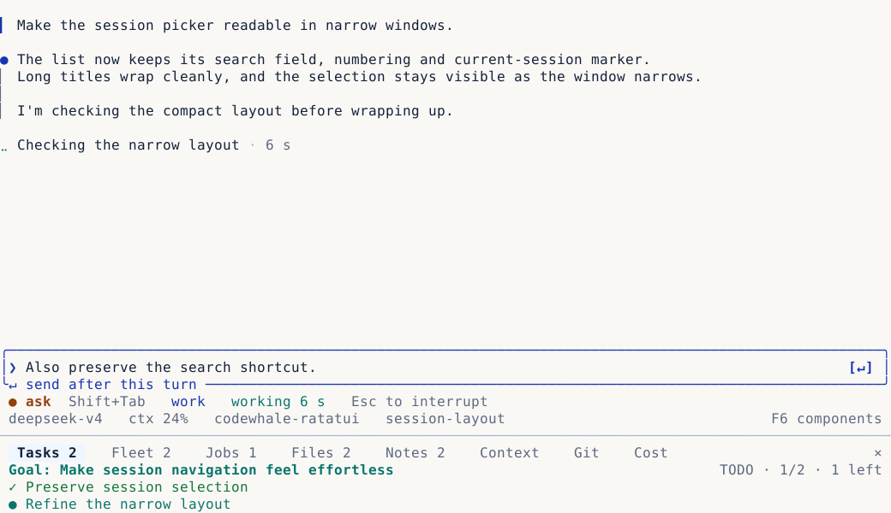
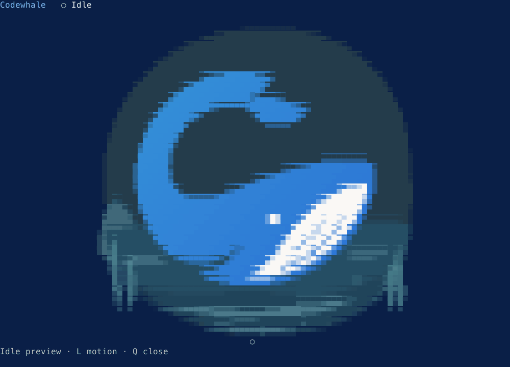
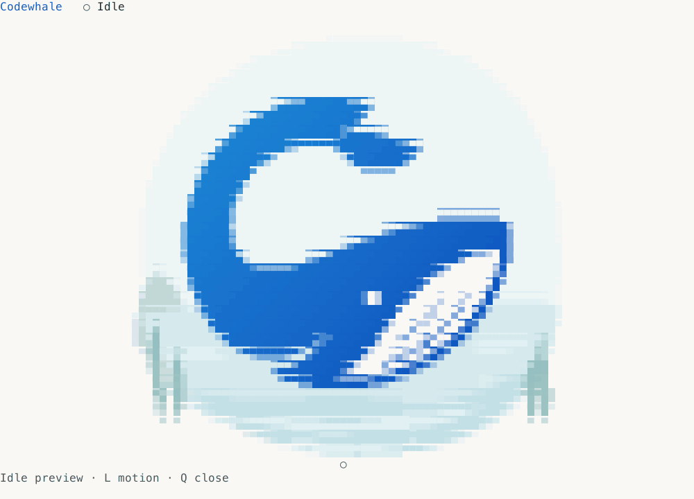

# Codewhale Ratatui

The terminal components behind [Codewhale](https://github.com/Hmbown/CodeWhale),
ready for your [Ratatui](https://ratatui.rs) app. An animated whale pet, native
layouts, ocean depth, and quiet motion. Your app owns the state and clock.



<details>
<summary>See the pet in light mode</summary>



</details>

**Meet your terminal companion.** `WhalePet` brings the original Codewhale
character into Ratatui: breathing, blinking, fins, activity props, calves and
water ripples. All 17 activities use the shared authored animation, with
readable state words and still, Braille and ASCII fallbacks.

```sh
cargo run --locked --example pet
```

From this cloned repository: **← / →** choose an action, **A** starts the tour,
**Space** toggles motion, **P** changes the terminal profile, and **Q** exits.
Move over the water to catch the whale's eye; click to make a ripple.
[Try the full pet view](#the-full-pet-view) · [Pet components](#the-animated-whale-pet) ·
[All 17 actions](#every-whale-action) · [Avatar packs](AVATARS.md)

<details>
<summary>Native conversation, composer and workbar</summary>



<details>
<summary>See WhaleLight</summary>



</details>

</details>

**One component or a whole workspace.** The original eight-panel workbar,
composer, sessions, settings, approvals and results share the same native
colors and backgrounds. All 16 TUI themes, fish, jellyfish, spinners and whale
actions are included. Your app owns the state and clock.

[Get started](GETTING-STARTED.md) · [Components](#explore-the-components) · [Terminal view guide](VIEWS.md) ·
[Design](DESIGN.md) · [Quality](QUALITY.md) · [Benchmarks](BENCHMARKS.md)

The [website explorer](WEBSITE.md) separates every catalogue entry into a
searchable component page, with terminal profiles, real width variants,
Rust rendering source and controlled animation playback.

## The full pet view

`PetMode` puts the whale at the center of a work surface, with optional reply
and agent panes. The example opens at rest; a host connects its own session,
activity and results. These clips show real terminal buffers from the example.



<details>
<summary>Light appearance</summary>



</details>

```sh
cargo run --locked --example pet_mode
```

**L** toggles motion; **Q** closes. For integration, start with
[`WhalePet` and `Stage`](GETTING-STARTED.md#add-the-animated-pet), or use
[`PetMode` and `PetModeState`](COMPONENTS.md#full-pet-mode) for the larger surface.
The optional [2D avatar example](AVATARS.md) previews the Whale girl and local packs.

## Get started

Run an editable app first:

```sh
git clone https://github.com/Hmbown/codewhale-ratatui
cd codewhale-ratatui
cargo run --locked --example starter
```

Type a message, press **Enter** to echo it, and **Esc** to exit. Then run
`cargo run --locked --example recipes` for five small pieces you can copy:
the composer, Tasks workbar, native water, a still whale and a live whale.

To add components to your own Ratatui app:

```toml
[dependencies]
codewhale-ratatui = { git = "https://github.com/Hmbown/codewhale-ratatui" }
ratatui = { version = "0.30.2", default-features = false, features = ["std", "crossterm_0_29"] }
crossterm = "0.29"
```

```rust
use codewhale_ratatui::{NativeComposer, Paint, Theme};

let theme = Theme::detect().tui();
let composer = NativeComposer::new("Review the changes")
    .focused(true);
frame.render_widget(composer.themed(&theme), frame.area());
```

Rust 1.89+. The example dependencies use Crossterm; an existing app can retain
its own backend. Keep your theme and input state between frames.
The [getting-started guide](GETTING-STARTED.md) covers state, actions, colors,
animation and common questions. The run commands above apply to this cloned
repository; adding a dependency does not install its example apps.

| You want to… | Start here |
| --- | --- |
| Build the native terminal layout | [Editable starter](examples/starter.rs), `TerminalShell`, `NativeComposer`, `Workbar` |
| Accept input and choices | `TextInputState`, `TextInput`, `Picker`, `List`, `Form` |
| Show conversation and work | `Message`, `Transcript`, `PendingInputPreview`, `AgentCard` |
| Review changes and results | `Diff`, `ApprovalCard`, `Receipt`, `ArtifactShelf` |
| Use Codewhale colors and depth | `Theme::tui`, `TuiPalette`, `OceanColumn` |
| Add the animated whale and cove | [`WhalePet` + `Stage`](examples/pet.rs) |
| Build a full pet work surface | [`PetMode` + `PetModeState`](examples/pet_mode.rs) |
| Add motion, whales and marine life | [Small recipes](examples/recipes.rs), [motion](examples/motion.rs), [habitat](examples/habitat.rs) |

## Explore the components

Open a collection to see its full dark and light previews. Every one of the
209 gallery entries is here, rendered from actual Ratatui buffers. The
[component guide](COMPONENTS.md) maps them to Codewhale's terminal views.
Run `cargo run --example gallery` to try every variation yourself.

<!-- gallery:start -->

### Native Codewhale

<a id="the-live-component-gallery"></a>
<details>
<summary>The live component gallery · 5 examples</summary>

The native conversation layout, composer and workbar, plus interactive component studies.


<details>
<summary>Light appearance</summary>


</details>

<details>
<summary>Watch the animation</summary>


</details>

</details>

<a id="the-animated-whale-pet"></a>
<details>
<summary>The animated whale pet · 5 examples</summary>

The native cove, reading, attention and pod, plus the full pet surface.


<details>
<summary>Light appearance</summary>


</details>

<details>
<summary>Watch the animation</summary>


</details>

</details>

<a id="codewhale-terminal-views"></a>
<details>
<summary>Codewhale terminal views · 22 examples</summary>

Sessions, settings, pickers and work panels built from reusable native parts.


<details>
<summary>Light appearance</summary>


</details>

</details>

<a id="the-native-composer-and-footer"></a>
<details>
<summary>The native composer and footer · 22 examples</summary>

Composer geometry, permission and mode, workflow rows and model/context metrics.


<details>
<summary>Light appearance</summary>


</details>

</details>

<a id="the-native-workbar"></a>
<details>
<summary>The native workbar · 12 examples</summary>

Tasks, Fleet, Jobs, Files, Notes, Context, Git and Cost; bottom, top and side placement.


<details>
<summary>Light appearance</summary>


</details>

</details>

### Color and atmosphere

<a id="every-codewhale-tui-theme"></a>
<details>
<summary>Every Codewhale TUI theme · 16 examples</summary>

Sixteen source presets with their actual backgrounds, status, permission and mode inks.


<details>
<summary>Light appearance</summary>


</details>

</details>

<a id="codewhale-water-and-ombres"></a>
<details>
<summary>Codewhale water and ombres · 10 examples</summary>

The current TUI ocean, plus optional Lagoon, Dusk, Coral and Graphite treatments.


<details>
<summary>Light appearance</summary>


</details>

</details>

### Inputs and controls

<a id="the-codewhale-language"></a>
<details>
<summary>The Codewhale language · 7 examples</summary>

Depth, rules, marks, hints and terminal chrome.


<details>
<summary>Light appearance</summary>


</details>

</details>

<a id="input-and-selection"></a>
<details>
<summary>Input and selection · 21 examples</summary>

Editable fields, forms, lists and focused choices.


<details>
<summary>Light appearance</summary>


</details>

</details>

<a id="navigation-and-controls"></a>
<details>
<summary>Navigation and controls · 7 examples</summary>

Headings, tabs, toggles and keyboard maps.


<details>
<summary>Light appearance</summary>


</details>

</details>

### Conversation and work

<a id="conversation-and-queued-input"></a>
<details>
<summary>Conversation and queued input · 12 examples</summary>

Rich prose, code, attached context and the next instruction.


<details>
<summary>Light appearance</summary>


</details>

</details>

<a id="conversation-and-agents"></a>
<details>
<summary>Conversation and agents · 13 examples</summary>

Inline messages and optional tool, agent and fleet cards.


<details>
<summary>Light appearance</summary>


</details>

</details>

<a id="work-and-results"></a>
<details>
<summary>Work and results · 25 examples</summary>

Diffs, trees, progress, approvals and run results.


<details>
<summary>Light appearance</summary>


</details>

</details>

<a id="optional-workspace-compositions"></a>
<details>
<summary>Optional workspace compositions · 5 examples</summary>

Desktop-inspired conversation, review and fleet layouts you can compose from the library.


<details>
<summary>Light appearance</summary>


</details>

</details>

### Motion and marine life

<a id="motion-and-feedback"></a>
<details>
<summary>Motion and feedback · 13 examples</summary>

Spinners, notifications and calm transitions.


<details>
<summary>Light appearance</summary>


</details>

<details>
<summary>Watch the animation</summary>


</details>

</details>

<a id="life-in-the-water"></a>
<details>
<summary>Life in the water · 5 examples</summary>

Fish, jellyfish and bubbles, drawn in terminal cells.


<details>
<summary>Light appearance</summary>


</details>

<details>
<summary>Watch the animation</summary>


</details>

</details>

<a id="a-whale-with-a-job"></a>
<details>
<summary>A whale with a job · 8 examples</summary>

Session state, attention, completion and the pod.


<details>
<summary>Light appearance</summary>


</details>

</details>

<a id="every-whale-action"></a>
<details>
<summary>Every whale action · 1 example</summary>

The complete v2 state vocabulary, in terminal cells.


<details>
<summary>Light appearance</summary>


</details>

<details>
<summary>Watch the animation</summary>


</details>

</details>

<a id="terminal-profiles"></a>
<details>
<summary>All nine terminal profiles</summary>


</details>

<!-- gallery:end -->

## Build with the kit

<details>
<summary>Composition, editing and stateful widgets</summary>

```rust
use codewhale_ratatui::{
    Depth, KeyHint, KeyHints, Paint, Panel, Picker, PickerItem, PickerState, Theme,
};

// Once, after enabling raw mode, if the host does not already detect it:
codewhale_ratatui::detect::probe_terminal_background();
let theme = Theme::detect().tui();

// In your draw callback, with a Ratatui area and buffer:
let hints = KeyHints::new(vec![
    KeyHint::new("↑↓", "move"),
    KeyHint::new("Enter", "select"),
    KeyHint::new("Esc", "cancel"),
]);
let inner = Panel::new(Depth::Overlay)
    .title("Mode")
    .hints(&hints)
    .draw(area, buf, &theme);
let items = [PickerItem::new("Work").key('1'), PickerItem::new("Plan").key('2')];
Picker::new(&items, PickerState::new(0)).paint(inner, buf, &theme);
```

Every `Paint` component also becomes a Ratatui widget with `.themed(&theme)`:

```rust
use codewhale_ratatui::{NativeComposer, Paint, Theme};
let theme = Theme::detect().tui();
let composer = NativeComposer::new("Review the changes")
    .target("my-project / main");
frame.render_widget(composer.themed(&theme), frame.area());
```

Keep a widget and render it by reference across frames:

```rust
let widget = composer.themed(&theme);
frame.render_widget(&widget, frame.area());
```

For a collection of different components, use `Themed::new(&dyn Paint, &theme)`.
The library enables no Ratatui terminal backend; your application selects its
backend. The [standalone consumer](tests/consumer/src/main.rs) demonstrates
this with `TestBackend`. The [starter app](examples/starter.rs) shows native
composition, Unicode editing, bracketed paste and terminal cleanup.

Lists and pickers also support `frame.render_stateful_widget`: keep a
`ListState` or `PickerState` in your app and pass the themed widget with that
state. Rendering stores the scroll offset for the actual viewport, including
query rows, tabs and clipping.

```rust
use codewhale_ratatui::{List, ListState, Paint};
// Keep `state` in your app between frames.
let rows = ["First session", "Second session"];
let list = List::new(&rows, ListState::default());
frame.render_stateful_widget(list.themed(&theme), frame.area(), &mut state);
```

Input states return outcomes for your app to act on. Typing and navigation
can repeat while a key is held; submit, choose, toggle and cancel require an
initial press. Modified navigation and activation shortcuts stay with your app.

Compose the native conversation layout:

```rust
use codewhale_ratatui::{
    Message, NativeComposer, Paint, PostureBar, TerminalShell,
    Workbar, WorkbarPanel, WorkbarRow,
};

let composer = NativeComposer::new("Review the changes").focused(true);
let workbar = Workbar::new(WorkbarPanel::Tasks, vec![
    WorkbarRow::new("task:review", "Review the changes").mark("●"),
]);
let shell = TerminalShell::new(composer.desired_height(area.width, area.height))
    .workbar_rows(workbar.height(area.width, &theme));
shell.paint(area, buf, &theme);
let regions = shell.areas(area);
Message::native("The changes are ready for review.").paint(regions.conversation, buf, &theme);
composer.paint(regions.composer, buf, &theme);
PostureBar::new("ask").paint(regions.posture, buf, &theme);
workbar.paint(regions.workbar, buf, &theme);
```

Choose a native background and keep the same components:

```rust
use codewhale_ratatui::{Theme, TuiPalette};
let theme = Theme::detect().tui_palette(TuiPalette::TokyoNight);
```

`Theme::tui()` chooses Underwater for a dark terminal and WhaleLight for a
light terminal. `Whale` and `WhaleLight` preserve the terminal-owned shell
backgrounds from the TUI. `Theme::new` also supports the existing desktop
role-token theme; `Ombre` offers additional spatial treatments. Native view
recipes are in [src/gallery/native_views.rs](src/gallery/native_views.rs).

For open water, paint foreground content first, then call `Habitat::paint`.
It protects occupied cells and their clearance; the entire jellyfish is
withheld when its silhouette cannot fit. Pass decision and overlay rectangles
to `Habitat::protected` so their blank space stays protected too. Keep a
dedicated habitat viewport separate from any decision overlay. The habitat
never requests a frame itself. Selection and pointer helpers use the same clipped
viewport passed to painting.

The whale's ordinary `Paint` implementation shows its current poster pose.
For animation, pass the packed `whale::Grid` evaluated by your existing
owner to `Whale::paint_frame(area, buf, &theme, &grid)`. The widget paints that
exact frame and its state words; it owns no Director or clock. The whole
frame must fit, with a row for the label. Invalid, narrow or ASCII frames
fall back to words. Repaint the underlying surface first because empty
cells in the frame are transparent. For the native animated performance, use `whale_motion::Stage` and
`colored_braille`; the [showcase host](examples/showcase.rs) demonstrates the
shared clock and motion policy.

The [gallery fixtures](src/gallery/) are runnable usage examples for every
family. [Component contribution instructions](CONTRIBUTING-COMPONENTS.md)
explain the rendering and ownership contracts.

## Choose a terminal profile

- **Truecolor:** native TUI presets retain exact source inks and grounds.
  `Theme::tui()` selects the native default; desktop role-token mode is also available.
- **256 colors:** native preset RGBs use the nearest fixed-cube index. Desktop
  role-token mode uses its contrast-audited table.
- **16 colors or unknown ground:** named terminal colors and visible marks/edges;
  the terminal owns the background.
- **`NO_COLOR`:** words, weight and marks carry every state.
- **`CODEWHALE_ASCII_SAFE=1`:** component chrome uses ASCII glyphs; user-authored
  Unicode remains text supplied by the host.

Set `CODEWHALE_APPEARANCE=light` or `dark` if the ground cannot be measured.
A host with its own detection can pass `Theme::new(Caps { depth, ascii,
appearance })` and avoid a second probe. Changes to a theme reach components
on their next paint; components hold roles rather than cached colors.


</details>

<details>
<summary>Full component reference</summary>

## Component catalogue

| Family | Components | What they do |
|---|---|---|
| Optional workspace composition | `WorkspaceFrame`, `WorkspaceAreas`, `PaneHeader`, `ContextRibbon`, `ContextItem` | Responsive conversation and dock regions, one quiet module header, composer-adjacent facts folded by priority with explicit counts |
| Native shell | `TerminalShell`, `ShellAreas` | Current conversation → pending input → composer → posture → workflows → metrics → workbar ordering |
| Native workbar | `Workbar`, `WorkbarPanel`, `WorkbarRow`, `WorkbarState`, `WorkbarLayout`, `WorkbarScrollbar`, `DockTabRow`, `DockTabPlan`, `DockTabStyles`, `DockTabTarget` | All eight panels, goals, row selection, keyboard outcomes, scrolling, hitboxes and bottom/top/side placement |
| Native composer and workflow rows | `NativeComposer`, `WorkflowProgress`, `WorkflowRun` | Rounded input enclosure, prompt, submit control, target chip and borderless workflow progress |
| Native footer | `PostureBar`, `MetricsLine`, `MetricSegment` | Permission and mode, clocks, live counts, context warnings and width-aware model/usage facts |
| Native views | `InstrumentSurface`, `SessionList`, `SessionRow` | TUI title/action rails, quiet gutters, session selection, ranges, search and rename presentation |
| TUI themes | `TuiPalette`, `TuiInk` | All 16 fixed source palettes, exact grounds and distinct native permission/mode/status inks |
| Attention and results | `AttentionQueue`, `AttentionItem`, `ArtifactShelf`, `Artifact` | Project-aware decisions, selected action hints, review/file/run/link results and reported receipts |
| Marine life | `Habitat`, `FishSchool`, `Jellyfish`, `BubbleField`, `HabitatDensity` | Native braille poses and ASCII silhouettes, caller-clock motion, bounded populations, complete visitors and text-safe open-water collision |
| Water and palette | `OceanColumn`, `OceanRamp`, `OceanPhase`, `OceanPaintFacts`, `OceanCausticFacts`, `OceanContrastInks`, `ocean_semantic_surfaces`, `Ombre`, `WaterPalette` | Native TUI depth column, context rise, steady attention tint, completion breath and five spatial materials; contrast and fallback guards |
| Living whale | `whale_motion::Stage`, `Director`, `ColoredGrid` | One session performance, authored clips and springs, native colored props, shared terminal cadence and hide/resume boundaries |
| Animated pet | `WhalePet`, `PetStyle` | Full-color native whale and cove, gaze and ripples, 17 activities, Braille and words-only fallbacks |
| Pet work surface | `PetMode`, `PetModeState` | Whale-centered view with optional reply and agent panes; caller-owned activity, focus and results |
| Session surfaces | `Message`, `ToolCard`, `Composer`, `AgentCard`, `Fleet` | Speaker anchors, output rails, honest omission counts, caller-owned prompts and each agent's own state, route and task |
| Pending input | `PendingInputPreview`, `PendingInputItem`, `ContextPreviewItem`, `PendingCard` | Queued, steering, editing, paused and in-flight input; native composer preview over localized caller facts; context and host-dispatched actions |
| Rich transcript | `Transcript`, `TranscriptBlock`, `TranscriptSpan`, `CodeBlock` | Authored headings, prose, quotes, lists, tables and numbered code; exact copy source and out-of-band links |
| Identity and state | `BrailleFrame`, `Whale`, `WhaleState`, `Icon`, `StatusMark`, `StateWords` | The v2 whale's 17 actions and pods; marks always paired with words; localized state labels |
| Surfaces | `Panel`, `Depth`, `Dialog`, `Sheet`, `HorizonRule` | Deep, stage, raised and overlay grounds; centered decisions, edge-anchored sheets and the composer ledge |
| Navigation | `Heading`, `Tabs`, `KeyHints`, `Keymap`, `Picker`, `List` | Shared heading hierarchy, selection, scrolling, keyboard labels and caller-owned outcomes |
| Input and controls | `TextInput`, `Form`, `Toggle`, `Segmented` | Unicode-aware editing, masked fields, validation and controls that explain disabled state |
| Search and empty states | `PickerQuery`, `PickerTabs`, `PickerMatches`, fuzzy matching helpers, `EmptyState` | Ranked choices, search highlights, tabs, previews and a clear next action when there are no results |
| Work and results | `Receipt`, `ReceiptTable`, `Diff`, `WorkflowTree`, `CountBar` | Measured values, explicit unknowns, numbered additions/removals, workflow hierarchy and progress from known totals |
| Decisions | `ApprovalCard`, `DecisionBand`, `ReviewVerdict`, `ReviewAggregate` | What will happen, where, why, and the caller's available next actions |
| Settings | `SettingRow`, `SettingDetail` | Value, source, lock reason, changed state, apply timing and reset details |
| Feedback and motion | `Toasts`, `Spinner`, `VerificationSpinner`, `MotionStep`, `MotionSet`, `FrameBudget` | Working swell, verification tick, notices, measured elapsed time, bounded transitions and reduced/still motion |

Words and data arrive from the caller, with English defaults where useful.
The kit does not calculate a diff, parse Markdown, validate credentials,
authorize a command, estimate cost or run an agent.

`OceanColumn` is adapted from the current TUI's three native stops:
`#102A45` → `#0A1E33` → `#061320`. Apply it after painting a scene to share
one continuous column behind ordinary grounds. Give it the full shell with
`.viewport(area)`, then use `.apply_matching(composer_area, buffer, theme, composer_ground)`
for a composer with its own base fill. The native [starter example](examples/starter.rs)
shows this complete composition. Selections, elevated panels,
diffs and code retain their backgrounds. The host supplies phase, elapsed time
and measured context; quiet policies stop breathing. The dark field is
opt-in on measured truecolor Ocean; light and limited-color terminals retain
their selected grounds.

`Ombre` finishes a painted scene with a spatial palette wash. It preserves
state ink and readable contrast, and leaves unsupported profiles unchanged.
The native TUI column is the studio default; the logo Ocean wash is also
available alongside Lagoon, Dusk, Coral and Graphite.


</details>

<details>
<summary>Animation, reduced motion and the host clock</summary>

## Spinners and animation

`Spinner` uses Codewhale's eight-frame swell; `VerificationSpinner` uses the
Engine's distinct round verification tick. Both wait 400 ms before moving,
advance at five steps per second, and keep the caller's work verb visible.
Reduced and still motion show a static mark plus words. ASCII terminals have
their own frames.

`MotionStep` and `MotionSet` handle token-timed state ink, selection movement
and detail reveal. The caller changes the state and supplies the instant;
the state words change immediately. `FrameBudget` combines redraw deadlines
and lets the host claim one primary spinner per frame. Once transitions
settle, the host can wait for input instead of painting identical frames.

The animated demonstrations are under [Motion and feedback](#motion-and-feedback).
The normal gallery samples fixed instants; `cargo run --example motion` is
the live example.

The native whale performance lives in `whale_motion`. A host keeps one `Stage`
per foreground session, reports explicit owner inputs, and advances it on its
own clock. `Tier::Terminal` caps active paints at six per second and rest at
two. Reduced motion uses authored posters; hiding and resuming discard missed
motion. `colored_braille` adds native body and prop inks to the exact packed
geometry. It uses majority visible ink per Braille cell because terminals
provide one foreground per cell. The [source and fixtures](assets/whale-motion/PROVENANCE.md)
pin the native implementation and its conformance oracle.


</details>

[Contribution guide](CONTRIBUTING-COMPONENTS.md) · [Changelog](CHANGELOG.md)

<details>
<summary>Maintainer notes: render previews, verify and update source assets</summary>

## Browse and regenerate

```sh
cargo run --example starter                          # small native application
cargo run --example pet                              # animated whale, actions and cove
cargo run --example pet_mode                         # full pet surface at rest
cargo run --example gallery                          # interactive catalogue
cargo run --example showcase                         # the full terminal studio
cargo run --example habitat                          # live fish, jellyfish, bubbles
cargo run --example motion                           # working, verification and transitions
cargo run --example gallery -- --print dark-256     # ANSI preview to stdout
cargo run --example gallery -- --dump out/          # .ans and styled .txt, all profiles
cargo run --example gallery -- --svg target/readme-buffers
python3 tools/render-gallery.py target/readme-buffers assets/readme --readme README.md
python3 tools/render-gallery.py target/readme-buffers assets/readme --readme README.md --check
```

The optional animation build needs Node, `sharp` and FFmpeg. Each animation
comes from deterministic actual-buffer frames, using one shared media builder:

```sh
cargo run --locked --example habitat -- --frames target/habitat-frames
node tools/render-animation.cjs target/habitat-frames assets/readme/habitat-motion.gif
python3 tools/check-animation.py target/habitat-frames assets/readme/habitat-motion.gif
cargo run --locked --example motion -- --frames target/motion-frames
node tools/render-animation.cjs target/motion-frames assets/readme/motion-demo.gif
python3 tools/check-animation.py target/motion-frames assets/readme/motion-demo.gif
cargo run --locked --example motion -- --frames target/motion-light-frames --profile light-truecolor
node tools/render-animation.cjs target/motion-light-frames assets/readme/motion-demo-light.gif
python3 tools/check-animation.py target/motion-light-frames assets/readme/motion-demo-light.gif
cargo run --locked --example showcase -- --frames target/showcase-frames
node tools/render-animation.cjs target/showcase-frames assets/readme/showcase.gif
python3 tools/check-animation.py target/showcase-frames assets/readme/showcase.gif
cargo run --locked --example showcase -- --frames target/showcase-light-frames --profile light-truecolor
node tools/render-animation.cjs target/showcase-light-frames assets/readme/showcase-light.gif
python3 tools/check-animation.py target/showcase-light-frames assets/readme/showcase-light.gif
cargo run --locked --example showcase -- --frames target/whale-action-frames --section life
node tools/render-animation.cjs target/whale-action-frames assets/readme/whale-performance.gif
python3 tools/check-animation.py target/whale-action-frames assets/readme/whale-performance.gif
```

CI verifies both the current frame hash and the GIF file hash; it needs no
raster tools. Static previews and the live terminal example use the normal
Rust/Python toolchain.

In the interactive gallery: `↑↓` or `j/k` selects a component, `p/P` switches
terminal profile, `w/W` switches width, `PgUp/PgDn` scrolls tall previews,
`Home/End` jumps through them, and `q` or `Esc` exits. This includes the full
17-action whale sheet on an ordinary-height terminal. `f` expands the canvas
for the composed workspace scenes. The habitat example uses `p` for profile,
`m` for motion and `q` to close.
In the motion example, `Space` finishes or restarts the demonstration, `v`
switches working/verification, `r` replays, `p` changes profile, and `m`
changes motion policy. `q` or `Esc` closes it.

In the studio, `F1`–`F6` choose the six sections. `F7` changes terminal profile,
`F8` motion policy, `F9` native TUI theme, and `F10` the example work phase.
The composer starts focused. `Enter` queues a follow-up while work is running;
`Esc` interrupts the illustrative turn and keeps the draft. `Shift+Tab` changes
permission. The decision accepts an explicit answer. Life uses `←→` to study
an action and `Space` to play all seventeen.
In Work, `Ctrl+X` opens Fleet, `Alt+W` focuses the workbar, and Left/Right
switches its panel while focused. `Esc` closes the dock. Color controls select
optional ombré washes separately from the native F9 theme.
Components supports search and tall-preview scrolling. `Ctrl+R` restarts the
demonstration; `q` or `Esc` closes outside editing.
`Ctrl+C` closes from any section or focus.

Profiles: `dark-truecolor`, `dark-graphite`, `light-truecolor`, `dark-256`,
`light-256`, `ansi-16`, `unknown-ground`, `no-color`, `ascii`.

## Verify it

```sh
cargo fmt --check
cargo clippy --all-targets --locked -- -D warnings
cargo test --locked
cargo test --example gallery --locked
cargo run --locked --manifest-path tests/consumer/Cargo.toml
RUSTDOCFLAGS=-Dwarnings cargo doc --locked --no-deps
python3 vendor/codewhale-design/generate.py --check
```

Run `cargo bench --bench render` for the prepared-widget and native-view
measurements described in [BENCHMARKS.md](BENCHMARKS.md).

Snapshots record the role each run uses, alongside its glyphs. Tests exercise
profiles and widths, Unicode input, missing data, clipped output and disabled
controls. The generated README boards can be checked separately with the
command above. GitHub CI qualifies the branch; a local pass proves local
behavior only.

## Update source palettes and design assets

The native TUI palette export retains the source's backgrounds, permission,
mode and status slots. With a current Codewhale checkout:

```sh
python3 tools/export-tui-palettes.py ../codewhale
python3 tools/export-tui-palettes.py ../codewhale --check
```

Tokens are vendored from the private `codewhale-design` source. Maintainers
with that checkout can sync and regenerate:

```sh
../codewhale-design/scripts/sync-to.sh .
CODEWHALE_BLESS=1 cargo test --test generated
```

`src/roles.rs` is generated from the tokens, including terminal-derived hint,
dim and diff-tint roles. Contrast tests cover truecolor and quantized colors.

`assets/whale-v2.scenes` holds contours exported from the v2 whale kit. To
update or check them with that source available:

```sh
node tools/export-whale.cjs <path-to-whale-character-v2>
node tools/export-whale.cjs <path-to-whale-character-v2> --check
```

`tests/whale.rs` checks all 17 actions against the kit's 32×16 and 20×10 stills,
dot for dot. Artwork shows up to three calves; the state label gives the true
agent count, including larger fleets. Compact or ASCII terminals keep the
state in words when the art cannot fit.


</details>

MIT · [License](LICENSE). Use as a Git dependency during development;
the crate has not been published to a package registry.

### Native decision band

`DecisionBand` extends the approval components with a bottom-anchored native
band over caller-projected body, option and validated rule-coverage facts.
`plan(area)` returns the same body/control/save region, stable option-order
rectangles and save visibility that `render(area, buffer)` paints. A host keeps
its own decision handler and enables persistent-save keys only while the last
paint reports `save_shown`; no `ApprovalState` or second decision loop is needed.
The gallery's `approval-native-band` and collapsed companion use this real API.
The existing bordered `ApprovalCard` keeps its verbatim-subject and caller-key
contract. The band accepts host-projected display lines; it does not reparse
commands, infer policy or construct permission rules.

### Mounted composer row plan

`NativeComposerFrame` projects host-owned scalar cursor/selection, localized
styled copy, completion/history menu facts and live styles through one pure
layout/paint/caret/viewport/pointer plan. Raw source positions retain hidden
characters; display content is guarded before width measurement and paint.
`NativeComposer` uses the same plan and keeps its existing grapheme cursor
API. The actual `native-composer-rich-selection` and `native-composer-rich-search` gallery
entries show both presentations. Editing, bindings, IME, completion filtering
and submit dispatch stay with the host.


### Mounted transcript viewport

`TranscriptViewport` projects host-parsed styled rows through one clipped
content/chrome plan, retaining pinned rows, offsets, semantic styles and exact
scrollbar/jump geometry. `TranscriptViewportPlan::link_rects` returns only
visible cells and excludes opaque jump chrome; targets never enter kit data.
The measured selection helper accepts a host's existing terminal column grammar
without owning its parser, clipboard, streaming cache or selection state.
Staged content/chrome paint lets a host retain semantic Ocean finishing between
them. The actual `transcript-mounted` and `transcript-mounted-focus` gallery
entries use this API. Existing authored `Transcript`/`TranscriptBlock` remain
the structured content option; this viewport does not reparse native rows.


`ocean::OceanPaintFacts` carries cached absolute-row colors and protected
semantic rectangles into `OceanColumn::apply_native`; its ink callback returns
the exact color the host backend would show over the proposed water without
changing source cells. `OceanContrastInks` maps the same decorative/supporting
contrast floors to actual live palette colors. `ocean_semantic_surfaces`
projects display-safe prewrapped styled rows using the host's column grammar;
`TranscriptViewportPlan::display_rows()` supplies its exact pinned/offset rows;
explicit backgrounds remain semantic even if their RGB equals a pane base.
`apply_caustics` finishes only already painted ordinary water, shares capability
and reduced-motion gates, and spares visible symbols, reversed cells and
semantic padding. Both methods retain the existing measured dark truecolor
Ocean gate; facts and an explicit ramp do not grant terminal capability. The
`ocean-native-guarded` gallery entry exercises cached water, caustics, selected
source, blank semantic padding and reverse protection across all profiles.

### Host-owned Dock tabs and character frames

`DockTabRow` is the tab row used by `Workbar` and the native Engine Dock
adapter. Give it the caller's available `WorkbarTab` facts, active panel,
pressed/hovered targets, five live `DockTabStyles` and the close text that matches
your actual action. `row.plan(area).hitboxes()` and `(&row).render(area, buf)` use
the same fitting rules. The host owns focus, Esc handling and action dispatch.
The Engine's full Dock body remains separate from this tab presentation slice.

For a small companion or an externally simulated frame with a raw caption:

```rust
use codewhale_ratatui::BrailleFrame;
use ratatui::{style::Style, widgets::Widget};

// Row-major packed cells from your existing simulation; zero is transparent.
BrailleFrame { cells: &cells, caption: "resting", style: Style::default() }
    .render(area, buf);
```

The last viewport row holds the centered caption. Tiny viewports keep the
complete wrapped text cue. Ink and modifiers are supplied by the caller; the
component has no clock or activity model. The Engine cameo and live embedded
world both use this path. `Whale::paint_frame` shares its cell painter and keeps
its own semantic caption, admission rules and theme gradient. This API does not
replace the Engine's character controller or accessibility policy.

The guarded Ocean gallery uses `OceanPaintFacts`, `OceanCausticFacts` and
`ocean_semantic_surfaces`; `OceanContrastInks` supplies host role mapping for
native finishing through the existing guarded
`OceanColumn` methods. Their facts preserve host protection and ink roles;
terminal capability, motion and semantic contrast guards still apply.

`WorkbarLayout::for_body` fits the already-admitted body viewport from current
row counts and header facts. `WorkbarScrollbar` paints its rail using the same
current offset/counts and caller-supplied symbols/styles. Both Workbar and the
Engine body use these calculations. No remembered selection, focus or scrolling
state lives in the kit; native row composition and action receipts stay with
the host.
